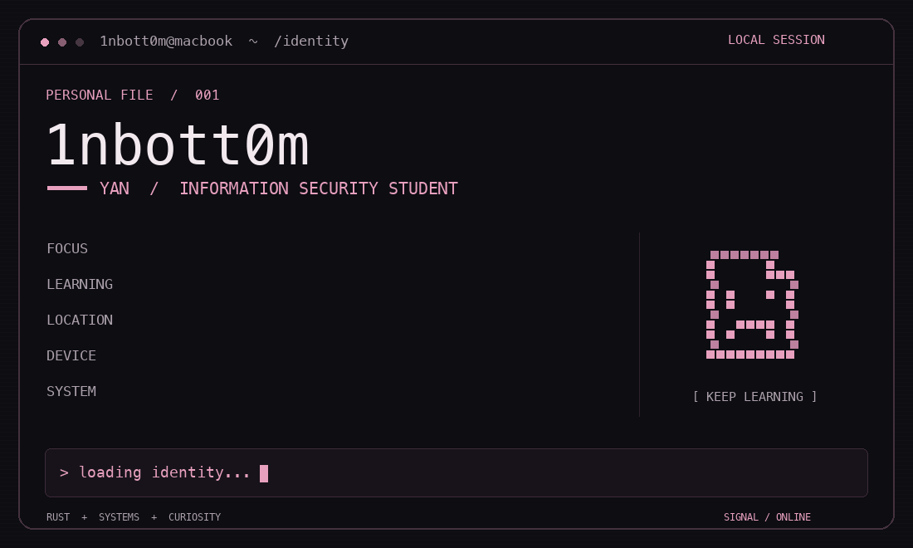
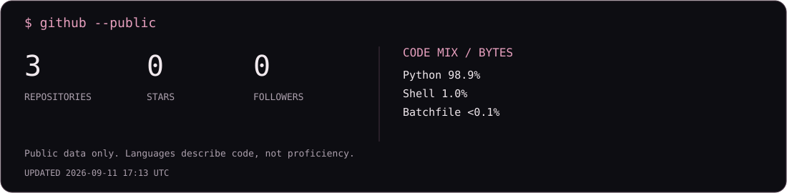

<p align="center">
  
</p>

### `> whoami`

I'm **Yan**, an information security student from Moscow. I enjoy understanding how security products work and explaining complex concepts in simple terms.

Currently learning **Rust, Linux and Git**. Python is a work tool.

### `> system_profiler`

```text
MacBook Pro  /  Apple M2
macOS       /  24 GB RAM  /  1 TB SSD
```

### `> github --public`

<p align="center">
  
</p>

<sub>Statistics are generated from the GitHub API and scheduled to refresh daily. Public, non-fork repositories are used for stars and language composition.</sub>
