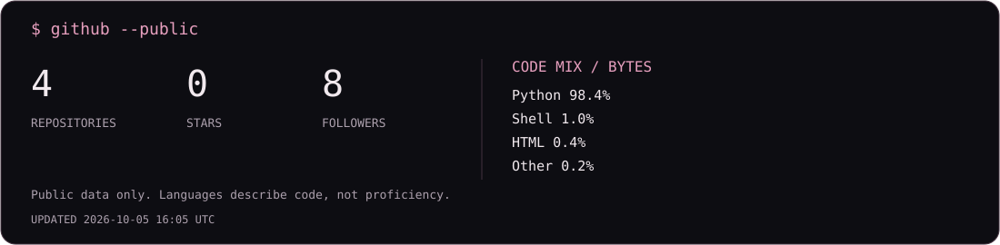

  

### `> inbottom`

Building and learning in public.

### `> github --public`

  

Statistics are generated from the GitHub API and scheduled to refresh daily. Public, non-fork repositories are used for stars and language composition.
